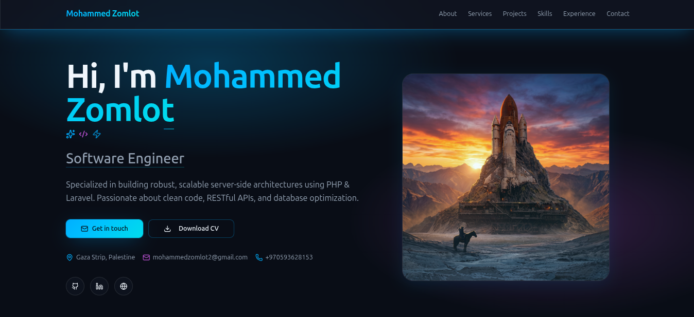

# Portfolio CMS API 🚀

<a href="https://mohammedzomlot.dev"></a>

A modern, high-performance headless Content Management System (CMS) built with **Laravel 13** and **PHP 8.5**. This application serves as a pure backend API for my personal portfolio at [mohammedzomlot.dev](https://mohammedzomlot.dev). It is designed with an API-first approach, providing exclusively RESTful JSON endpoints without any integrated frontend tooling or templates.

[](https://github.com/mohammedzom/Portfolio-CMS/actions/workflows/laravel-ci.yml)

## 🌟 Features

- **Project Management:** Complete CRUD with multi-image uploads, slug generation, and order sorting.
- **Skill Tracking:** Categorize and rank technical skills using dedicated Skill Categories.
- **Professional Showcase:** Manage Services, Experiences, Educations, and Achievements to display a complete professional history.
- **Site Settings:** Manage global portfolio information (bio, social links, etc.).
- **Messaging System:** Secure contact form endpoints with read/unread tracking.
- **Admin Dashboard:** Aggregated analytics and recent data overview.
- **Robust Authentication:** Secured via Laravel Sanctum and API key validation.

## 🏗️ Architecture & Best Practices

This project strictly adheres to modern Laravel architecture and "Skinny Controller" principles:

- **Pure API:** No frontend build tools, no Blade templates. All functionality is exposed via structured REST endpoints using Laravel Eloquent API Resources.
- **Action Classes:** Complex business logic (like handling multiple file uploads and database transactions) is extracted into single-purpose Action classes using `lorisleiva/laravel-actions`.
- **Data Integrity:** Database operations involving multiple steps or file uploads are wrapped in `DB::transaction()` to prevent data corruption.
- **Performance:** Extensive use of Laravel Cache to serve read-heavy endpoints (like the public portfolio) blazingly fast. 
- **Type Safety:** Strict return type hinting (`JsonResponse`) across all API controllers.
- **Validation:** Dedicated `FormRequest` classes handle incoming data validation and custom error messages.

## 🧪 Testing

The API is covered by feature tests written in **Pest** (`pestphp/pest`).
To run the test suite:

```bash
composer run test
```

## 🛠️ Tech Stack

- **Framework:** Laravel 13
- **Language:** PHP 8.5
- **Authentication:** Laravel Sanctum
- **Testing:** Pest v4
- **Formatting:** Laravel Pint

## 🚀 Getting Started

1. Clone the repository.
2. Run the setup script which will install dependencies, copy `.env.example` to `.env`, generate the app key, and run migrations:
   ```bash
   composer run setup
   ```
3. Link storage (for project images and uploads):
   ```bash
   php artisan storage:link
   ```
4. Start the local development server (API only):
   ```bash
   composer run dev
   ```

## 📚 API Documentation

A comprehensive Postman collection is available in the `resources/` directory (`Portfolio-cms.postman_collection.json`) containing all available endpoints, required headers, and payload examples for both the public API and the protected Admin API.
